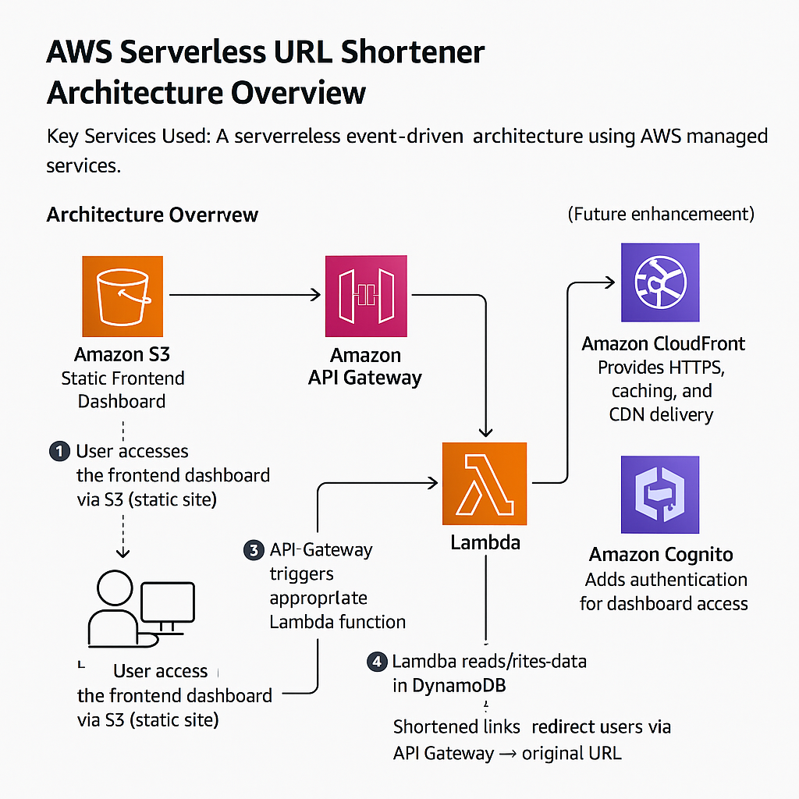

# 🚀 AWS Serverless URL Shortener (Proof of Concept)

This project is a **serverless URL shortener** built entirely on **Amazon Web Services (AWS)**.  
It demonstrates how to combine AWS managed services to create a **low-cost, scalable, and secure** application — perfect for a **Proof of Concept (PoC)** and portfolio showcase.

---

## ✨ Features
- Shorten long URLs into unique short links.
- Redirect short links to original URLs.
- Track usage statistics (click count, creation date).
- Web-based dashboard hosted on **Amazon S3**.
- Serverless, fully managed, and near-zero cost under AWS Free Tier.

---

## 🏗️ Architecture


**AWS Services Used:**
- **Amazon S3** → Hosts the static frontend dashboard.  
- **Amazon API Gateway** → Provides REST API endpoints.  
- **AWS Lambda** → Handles backend logic (shorten, redirect, stats).  
- **Amazon DynamoDB** → Stores URL mappings and statistics.  
- **Amazon CloudFront** *(optional)* → CDN & HTTPS.  
- **Amazon Cognito** *(optional)* → User authentication for dashboard.  

---

## 📂 Project Structure
aws-serverless-url-shortener/
│
├── frontend/ # Static website (S3-hosted)
│ ├── index.html
│ └── app.js
│
├── backend/ # Lambda functions
│ ├── shortenUrl.py
│ ├── redirectUrl.py
│ └── getStats.py
│
├── docs/ # Documentation
│ ├── aws_serverless_url_shortener_poc.pdf
│ ├── architecture-diagram.png
│
└── README.md


---

## ⚙️ Setup Instructions

### 1. DynamoDB
- Create a table named `UrlMappings`
- Partition key: `shortId` (String)

### 2. Lambda Functions
Deploy three Lambda functions:
- `shortenUrl` → Creates a short ID and stores mapping.
- `redirectUrl` → Redirects to original URL and increments counter.
- `getStats` → Fetches click stats from DynamoDB.

### 3. API Gateway
- **POST /shorten** → Trigger `shortenUrl`  
- **GET /{shortId}** → Trigger `redirectUrl`  
- **GET /stats/{shortId}** → Trigger `getStats`  
- Enable **CORS**.  
- Deploy API.  

### 4. Frontend (S3 Hosting)
- Upload files from `/frontend` to an **S3 bucket**.  
- Enable **static website hosting**.  
- Set bucket policy to allow public access (or use CloudFront for secure HTTPS).  

---

## 📊 Example Usage

### Shorten URL
```http
POST /shorten
{
  "longUrl": "https://www.google.com"
}

Response:
{
  "shortId": "abc123",
  "shortUrl": "https://<api-id>.execute-api.<region>.amazonaws.com/dev/abc123"
}

Redirect:
Visiting https://.../abc123 → Redirects to https://www.google.com

Stats:
GET /stats/abc123

Response:
{
  "shortId": "abc123",
  "longUrl": "https://www.google.com",
  "clickCount": 5,
  "createdAt": "2025-09-02T12:00:00Z"
}
=======
# aws-serverless-url-shortener
Serverless URL Shortener PoC using AWS (S3, API Gateway, Lambda, DynamoDB)
